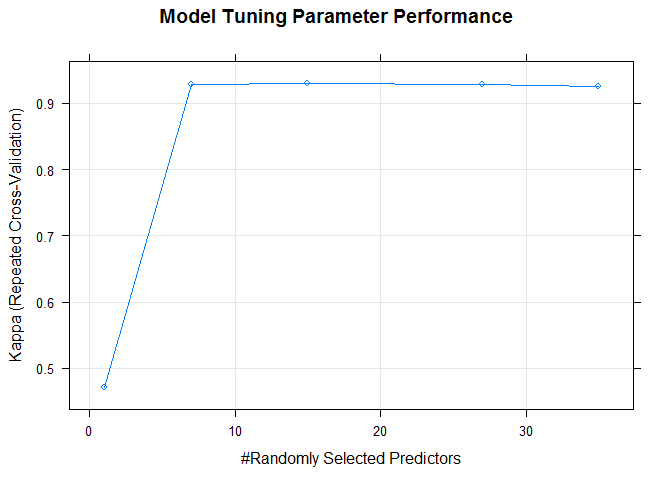
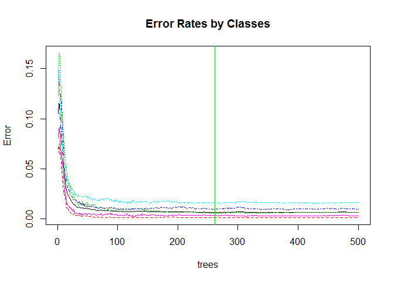
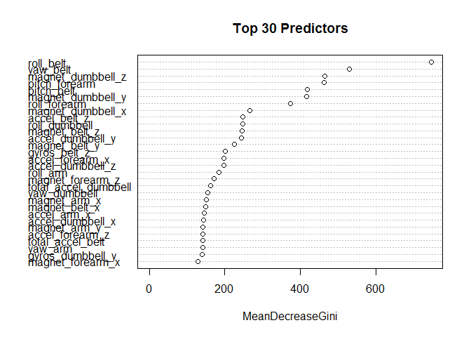

# Predictive Model for Classifying Quality of Activity using Weight Lifting Exercise (WLE) Dataset
A. Listener  
Saturday, March 14, 2015  

# Approach for Machine Learning

The goal of this machine learning algorithm is to predict the manner in which the users did the WLE exercises, classified as A,B,C,D or E. This is the "classe" variable in the dataset. We have two datasets at hand:

- A **training set** containing **19622** observations for **158** predictors and **classe** classification response.
- A **prediction set** containing **20** observations, with **158** predictors but no **classe** response.

In building our model, we will take the following approach:

1. Split the **training set** into **training data** (60%) and **testing data** (40%)
2. Run the two models on the **training set** using cross-validation and parameter tuning
3. Predict the accuracy of the model using the **validation set** and compute **estimated out of bag error rate**
4. Compare the various models constructed using the **prediction set**
5. Identify the more accurate model. 

We are not concerned with interpretability of the model as much as the accuracy of the classification here. Hence, we have utilised the following two classification models:

- cForest: **Conditional Inference Random Forest**-*random forest and bagging ensemble algorithms utilizing conditional inference trees as base learners* 
- randomForest: **Breiman's random forest algorithm**

# Data Source

The Weight Lifting Exercise Dataset[^1] is made freely available by [Groupware@les][2].

**Important:** you are free to use this dataset for any purpose. This dataset is licensed under the **Creative Commons license (CC BY-SA)**. The CC BY-SA license means you can remix, tweak, and build upon this work even for commercial purposes, as long as you credit the authors of the original work and you license your new creations under the identical terms we are licensing to you. This license is often compared to "copyleft" free and open source software licenses. All new works based on this dataset will carry the same license, so any derivatives will also allow commercial use. Read more [here][4].

# Exploratory Data Analysis

In this section we will load and prepare the data for modelling subsequently.


```r
# load required packages
require(tree)
```

```
## Loading required package: tree
```

```r
require(randomForest)
```

```
## Loading required package: randomForest
## randomForest 4.6-10
## Type rfNews() to see new features/changes/bug fixes.
```

```r
require(party)
```

```
## Loading required package: party
## Loading required package: grid
## Loading required package: mvtnorm
## Loading required package: modeltools
## Loading required package: stats4
## Loading required package: strucchange
## Loading required package: zoo
## 
## Attaching package: 'zoo'
## 
## The following objects are masked from 'package:base':
## 
##     as.Date, as.Date.numeric
## 
## Loading required package: sandwich
```

```r
require(caret)
```

```
## Loading required package: caret
## Loading required package: lattice
## Loading required package: ggplot2
```

```r
require(data.table)
```

```
## Loading required package: data.table
```

```r
# Uncomment the statement below to save time to debug/ check the final output format, etc
# It should be commented out during production run 
# runmode <- "TEST"
```

## Load and Clean the WLE Dataset


```r
loadFile <- function(flag) {
    options(rpubs.upload.method = "internal")
    fpath <- "./data"
    fname <- paste("pml-", flag, "ing.csv", sep="")
    ffile <- paste(fpath, fname, sep="/")
    
    if (!file.exists(fpath)) {
        dir.create(fpath)
    }
    
    if (!file.exists(ffile)) {
        setInternet2(use=TRUE) # required to enable https download link in Windows OS
        url <- paste("https://d396qusza40orc.cloudfront.net/predmachlearn/", fname, sep="")        
        download.file(url=url, destfile=ffile, method="auto")
        dateDownloaded <- date()
    } else {
        dateDownloaded <- "Mar 18, 2015"
    }
    
    # use row.names=1 to exclude loading the first column
    # change all #DIV/0! to NA
    if (flag == "train") {
        trainData <- read.csv(file=ffile, header=TRUE, row.names=1, numerals="no.loss", 
                              na.strings=c("NA", "#DIV/0!"), nrows=100000)
        trainData
    } else {
        testData <- read.csv(file=ffile, header=TRUE, row.names=1, numerals="no.loss",
                             na.strings=c("NA", "#DIV/0!"), nrows=1000)
        testData
    }
}

cleanData <- function(flag, df) {
    # This function removes only the columns that have NAs in as from original data source
    # So, columns with blank fields or "#DIV/0!" are still retained
    # Logic is that different sensor readings will be blank in different exercises/ cases
    if (flag == "train") {
        df <- df[, colSums(is.na(df)) == 0] # remove columns that have NAs
    }
    
    # remove first six columns from the data frames:
    # 1. user_name: do not want bias by an individual as need to predict based on sensor data
    # 2. raw_timestamp_part_1: there is no timeseries related data
    # 3. raw_timestamp_part_2: same as above
    # 4. cvtd_timestamp: no timeseries data needed
    # 5. new_window: not sensor data
    # 6. num_window: not sensor data
    # change one column to Date type for both test and train data
    # df$cvtd_timestamp <- strptime(x=as.character(df$cvtd_timestamp),
    #                              format="%d/%m/%Y %H:%M")
    df <- df[,7:ncol(df)]
    df
}

# Load and Clean Train and Test Data
trainingData <- loadFile("train") # Fetch training file and load data in R
trainingData <- cleanData("train", trainingData) # Tidy the data for processing
predData <- loadFile("test") # Fetch testing file and load data in R
predData <- cleanData("test", predData) # Tidy the test data for predicting
# keep columns in prediction data same as in training, except predictor column      
predData <- predData[,colnames(trainingData[colnames(trainingData) != "classe"])]
# Take a small subset of the total training data when runing for testing to save time
# Uncheck the comments below while running in TEST mode
# if (runmode == "TEST") {
#    trainCount <- as.integer(nrow(trainingData)*.02) 
#    trainIdx <- sample(1:nrow(trainingData), trainCount, replace=FALSE)
#    trainingData <- trainingData[trainIdx,]
# }
```

## Sanity Check the Clean Data


```r
names(trainingData)
```

```
##  [1] "roll_belt"            "pitch_belt"           "yaw_belt"            
##  [4] "total_accel_belt"     "gyros_belt_x"         "gyros_belt_y"        
##  [7] "gyros_belt_z"         "accel_belt_x"         "accel_belt_y"        
## [10] "accel_belt_z"         "magnet_belt_x"        "magnet_belt_y"       
## [13] "magnet_belt_z"        "roll_arm"             "pitch_arm"           
## [16] "yaw_arm"              "total_accel_arm"      "gyros_arm_x"         
## [19] "gyros_arm_y"          "gyros_arm_z"          "accel_arm_x"         
## [22] "accel_arm_y"          "accel_arm_z"          "magnet_arm_x"        
## [25] "magnet_arm_y"         "magnet_arm_z"         "roll_dumbbell"       
## [28] "pitch_dumbbell"       "yaw_dumbbell"         "total_accel_dumbbell"
## [31] "gyros_dumbbell_x"     "gyros_dumbbell_y"     "gyros_dumbbell_z"    
## [34] "accel_dumbbell_x"     "accel_dumbbell_y"     "accel_dumbbell_z"    
## [37] "magnet_dumbbell_x"    "magnet_dumbbell_y"    "magnet_dumbbell_z"   
## [40] "roll_forearm"         "pitch_forearm"        "yaw_forearm"         
## [43] "total_accel_forearm"  "gyros_forearm_x"      "gyros_forearm_y"     
## [46] "gyros_forearm_z"      "accel_forearm_x"      "accel_forearm_y"     
## [49] "accel_forearm_z"      "magnet_forearm_x"     "magnet_forearm_y"    
## [52] "magnet_forearm_z"     "classe"
```

There are a total of 52 predictors in the clean data (i.e. after removing all columns with NAs/ #DIV/0!) as compared to 158 in the original dataset. We have effectively reduced the feature space by 67.09%.


```r
identical(names(trainingData[,1:ncol(trainingData)-1]), names(predData))
```

```
## [1] TRUE
```

The Prediction Data against which we will use our model to predict expected classification of **classe** variable should also have exactly the same predictors. We can see above that both are the same except that the Training Data has the response variable as well. 


```r
# Split the Training data into Train and Test Data sets to estimate OOB error rate
trainIdx <- createDataPartition(y=trainingData$classe, p=0.6, list=FALSE)
trainData <- trainingData[trainIdx,]
testData <- trainingData[-trainIdx,]
dim(trainData); dim(testData)
```

```
## [1] 11776    53
```

```
## [1] 7846   53
```

For model training, the number of rows and total columns (predictors plus response) for the **Train Data** and **Test Data** are shown above.


```r
a <- as.data.table(table(trainingData$classe))
b <- as.data.table(table(trainData$classe))
c <- as.data.table(table(testData$classe))
tbl <- merge(a,b,by="V1")
tbl <- merge(tbl,c,by="V1")
setnames(tbl,c("Class","Original","Training","Test"))
tbl
```

```
##    Class Original Training Test
## 1:     A     5580     3348 2232
## 2:     B     3797     2279 1518
## 3:     C     3422     2054 1368
## 4:     D     3216     1930 1286
## 5:     E     3607     2165 1442
```

The break-up of the **Original Dataset** into the **Train Set** and **Test Set** is provided above.


```r
# Percentage breakup for Original, Validation and Test Sets
mtx <- data.matrix(tbl, rownames.force=TRUE)
mtx <- data.frame(round(prop.table(mtx, 2), 5) * 100)
mtx$Class <- tbl$Class
mtx
```

```
##   Class Original Training   Test
## 1     A   28.437   28.431 28.448
## 2     B   19.351   19.353 19.347
## 3     C   17.440   17.442 17.436
## 4     D   16.390   16.389 16.391
## 5     E   18.382   18.385 18.379
```

It is easily confirmed, as above, that the distribution of the observations by class across Original, Training and Test datasets is consistent. Hence, we have not introduced any bias in our training or validation set through the used data partitioning method.

## Predictive Model 1: Conditional Inference Random Forest

The details of the first model are:

1. **Training** Data will be used to train the model. Internally, the training data will be split into **Train** and **Validation** partitions during cross-validation
2. **TrControl** is used to set a **3-fold cross-validation** during model run and repeated 10 times (unable to set a higher k-fold cv due to laptop limitations)
3. **TuneGrid** is used to set values for the **mtry** tuning parameter available for the method chosen for building this model, i.e. cForest 
4. Conditional Inference Random Forest is used as the **method**
5. The fitted model is then used to predict against the 40% observations set aside as **Test set** to estimate the expected **Test Error Rate** 


```r
set.seed(1857) # set seed for research reproducibility

# Control parameters for cross-validation
fitControl <- trainControl(method="repeatedcv",
                           # 3-fold CV
                           number = 3,
                           # repeated ten times
                           repeats = 10)
# Tuning Parameter for training the model
fitGrid <- expand.grid(mtry=c(1, 7, 15, 27, 35))
# Conditional Inference Random Forest
modelTrain <- train(as.factor(classe)~., data=trainData, 
                    method="cforest", metric="Kappa",
                    trControl=fitControl,
                    tuneGrid=data.frame(fitGrid))
modelTrain
```

```
## Conditional Inference Random Forest 
## 
## 11776 samples
##    52 predictor
##     5 classes: 'A', 'B', 'C', 'D', 'E' 
## 
## No pre-processing
## Resampling: Cross-Validated (3 fold, repeated 10 times) 
## 
## Summary of sample sizes: 7851, 7850, 7851, 7849, 7850, 7853, ... 
## 
## Resampling results across tuning parameters:
## 
##   mtry  Accuracy   Kappa      Accuracy SD  Kappa SD   
##    1    0.6038139  0.4700929  0.088372734  0.124457792
##    7    0.9439622  0.9289962  0.004772004  0.006061424
##   15    0.9454653  0.9309390  0.004552873  0.005780127
##   27    0.9435971  0.9285887  0.004636477  0.005879364
##   35    0.9417543  0.9262607  0.004354113  0.005523404
## 
## Kappa was used to select the optimal model using  the largest value.
## The final value used for the model was mtry = 15.
```

The fitted model shows that the best accuracy was achieved with the **tuning parameter** set at **15**.


```r
plot(modelTrain, main="Model Tuning Parameter Performance")
```

 

The plot above shows the optimal value of the tuning parameter. We can also see from the plot that the accuracy of the method increases rapidly initially as number of randomly selected predictors increase, but then flattens out and in fact, starts to drop as the tuning parameter is further increased. 


```r
# Predict against the Validation/ Test Data set aside from Training Data
predCForest <- predict(modelTrain, testData)
a <- confusionMatrix(predCForest, testData$classe)
a
```

```
## Confusion Matrix and Statistics
## 
##           Reference
## Prediction    A    B    C    D    E
##          A 2198   73    2   11    1
##          B   16 1389   52    0    1
##          C   10   46 1298   57    7
##          D    3    9   16 1216   22
##          E    5    1    0    2 1411
## 
## Overall Statistics
##                                           
##                Accuracy : 0.9574          
##                  95% CI : (0.9527, 0.9618)
##     No Information Rate : 0.2845          
##     P-Value [Acc > NIR] : < 2.2e-16       
##                                           
##                   Kappa : 0.9461          
##  Mcnemar's Test P-Value : < 2.2e-16       
## 
## Statistics by Class:
## 
##                      Class: A Class: B Class: C Class: D Class: E
## Sensitivity            0.9848   0.9150   0.9488   0.9456   0.9785
## Specificity            0.9845   0.9891   0.9815   0.9924   0.9988
## Pos Pred Value         0.9619   0.9527   0.9154   0.9605   0.9944
## Neg Pred Value         0.9939   0.9798   0.9891   0.9894   0.9952
## Prevalence             0.2845   0.1935   0.1744   0.1639   0.1838
## Detection Rate         0.2801   0.1770   0.1654   0.1550   0.1798
## Detection Prevalence   0.2912   0.1858   0.1807   0.1614   0.1809
## Balanced Accuracy      0.9846   0.9521   0.9652   0.9690   0.9886
```

Both sensitivity and specificity are very high indicating an overall good model. The confusion matrix shows that class "B" has the **lowest sensitivity**, i.e. the model's rate of misclassification was highest when the actual class was "B". At the same time, it also shows that the **lowest specificity** was for class "A", i.e. highest occurence of misclassification as "A"" when the actual class was not "A". The overall **observed accuracy** of the model on the test set is **95.74%**. It does not mean much by itself. Kappa statistic, the overall measure of the model's performance above its **expected accuracy** for a random classifier, appears very high indicating the model is very accurate when compared to a random classifier.


```r
oob.err <- round((1-sum(diag(a$table))/sum(a$table))*100,2)
oob.err
```

```
## [1] 4.26
```

The **estimated out-of-bag error rate** from the training set is **4.26%**. We would expect the actual out of bag error estimate to be no lesser than this when running this model on the prediction data of 20 observations.


```r
predP1Forest <- predict(modelTrain, predData)
predP1Forest
```

```
##  [1] B A B A A E D B A A B C B A E E A B B B
## Levels: A B C D E
```

Finally, we predicted the classification for the 20 observations provided for the prediction set and uploaded the answers at [Coursera Online Form][5]. This model misclassified two of the observations, yielding a **true error rate** of **10%**, which is much higher than our estimate of **4.26%**. If we had more observations in the prediction data, say 1000, we would expect the true error rate to converge closer to the calculated OOB Error Rate.

## Second Predictive Model - Random Forest

The second model is a very fast algorithm in R that internally carries out cross-validation and provides out of the box error rates by using statistical estimation techniques within the algorithm. Hence, we did not ideally need to split the training data into training and validation sets. However, we have split it to compare the **OOB Error Estimate** from the model against the validation data set aside and analyse the difference against the first predictive model as well as against the **true test error rate** as discovered against the **prediction set**.


```r
set.seed(1857) # set seed for research reproducibility

# Split the Training Data into train and test sets
trainCount <- as.integer(nrow(trainingData)*.60) 
trainIdx <- sample(1:nrow(trainingData), trainCount, replace=FALSE) 
rf.wle <- randomForest(classe~., data=trainingData, subset=trainIdx, prox=TRUE)
rf.wle
```

```
## 
## Call:
##  randomForest(formula = classe ~ ., data = trainingData, prox = TRUE,      subset = trainIdx) 
##                Type of random forest: classification
##                      Number of trees: 500
## No. of variables tried at each split: 7
## 
##         OOB estimate of  error rate: 0.65%
## Confusion matrix:
##      A    B    C    D    E class.error
## A 3309    3    1    0    0 0.001207365
## B   11 2256    4    0    0 0.006605020
## C    0   15 2039    4    0 0.009232264
## D    0    0   30 1902    2 0.016546019
## E    0    0    1    5 2191 0.002730997
```

The number of optimal variables randomly selected at each split is **7**. The algorithm has estimated an **OOB error rate** of **0.65%**. This is significantly better than what we got for the first model. The associated **training confusion matrix** is also shown in the output above.


```r
predRForest <- predict(rf.wle, testData)
a <- confusionMatrix(predRForest, testData$classe)
a
```

```
## Confusion Matrix and Statistics
## 
##           Reference
## Prediction    A    B    C    D    E
##          A 2231    3    0    0    0
##          B    1 1514    2    0    0
##          C    0    1 1366    6    0
##          D    0    0    0 1280    0
##          E    0    0    0    0 1442
## 
## Overall Statistics
##                                           
##                Accuracy : 0.9983          
##                  95% CI : (0.9972, 0.9991)
##     No Information Rate : 0.2845          
##     P-Value [Acc > NIR] : < 2.2e-16       
##                                           
##                   Kappa : 0.9979          
##  Mcnemar's Test P-Value : NA              
## 
## Statistics by Class:
## 
##                      Class: A Class: B Class: C Class: D Class: E
## Sensitivity            0.9996   0.9974   0.9985   0.9953   1.0000
## Specificity            0.9995   0.9995   0.9989   1.0000   1.0000
## Pos Pred Value         0.9987   0.9980   0.9949   1.0000   1.0000
## Neg Pred Value         0.9998   0.9994   0.9997   0.9991   1.0000
## Prevalence             0.2845   0.1935   0.1744   0.1639   0.1838
## Detection Rate         0.2843   0.1930   0.1741   0.1631   0.1838
## Detection Prevalence   0.2847   0.1933   0.1750   0.1631   0.1838
## Balanced Accuracy      0.9995   0.9984   0.9987   0.9977   1.0000
```

The confusion matrix shows that both sensitivity and specificity for all the classes is very high and comparable. However, "B" is still the class with lowest sensitivity and "A" with the lowest specificity. The overall accuracy of the model is **99.83%**. Note that the algorithm has used internal calculations to provide a higher estimate of **0.65%**. We would expect the **true test error rate** to be no lesser than this when running this model on the prediction data of 20 observations.


```r
# For what number of trees is the OOB Error Rate the lwoest?
bestTrees <- which(rf.wle$err.rate[,1] == min(rf.wle$err.rate[,1]))
plot(rf.wle, main="Error Rates by Classes")
abline(v=bestTrees, col="green")
text(x=bestTrees-100, y=0.6, pos=3, offset=0, cex=0.8,
     labels="lowest OOB Error Rate\nNo gains beyond this point", col="green")
```

 

We can see from the plot above that the accuracy of the method initially increases rapidly  as number of trees are increased, but then flattens out beyond around 100 trees, though the actual best (lowest) OOB Error Rate is achieved as shown above at 262 number of trees.


```r
varImpPlot(rf.wle, type=2, scale=TRUE, main="Top 30 Predictors")
```

 

The chart above shows the relative importance of **Top 30** predictors in explaining the classification response accuracy as measured by Gini Index, the mean decrease in node impurtiy. 


```r
predP2Forest <- predict(rf.wle, predData)
predP2Forest; predP1Forest
```

```
##  1  2  3  4  5  6  7  8  9 10 11 12 13 14 15 16 17 18 19 20 
##  B  A  B  A  A  E  D  B  A  A  B  C  B  A  E  E  A  B  B  B 
## Levels: A B C D E
```

```
##  [1] B A B A A E D B A A B C B A E E A B B B
## Levels: A B C D E
```

Finally, we predicted the classification for the 20 observations provided for the prediction set. This model classified all of the observations correctly, yielding an **actual test error rate** of 0%, which is lower than estimated by the algorithm. This is no tusually expected, however, given that the estimated error rate is also pretty small, a larger prediction set (say a 1000 predictions) may have yielded a truer picture of the accuracy of this model. 

## Comparison of the Two Models

Obviously, for our purposes and this dataset, the second model is more accurate than the first model. Note that the interpretability of either model is not relatively straightforward. Hence, the accuracy comes at the cost of interpretability of the model.

We could have improved the accuracy of the first model by increasing the number of folds for cross-validation to 5 or 10 instead of 3. However, this was done due to the computational costs of running the model with 5 or 10-fold cross-validation on a laptop.

The accuracy in the first model is delivered at a significantly higher computational cost. In this specific instance, **cForest** method using **train** function completed in 12.5 hours. In contrast, the **randomForest** algorithm required about 2 minutes to fit the model while providing far higher accuracy. We could have improved the performance possibly by reducing the number of predictors. For e.g. by excluding the predictors which have near zero variance, since these may or may not add much to the quality of prediction. The model was, however, fit using all the available predictors in the clean data.

For the above reasons, randomForest is the preferred algorithm.

# References

[^1]: Velloso, E.; Bulling, A.; Gellersen, H.; Ugulino, W.; Fuks, H. Qualitative Activity Recognition of Weight Lifting Exercises. Proceedings of 4th International Conference in Cooperation with SIGCHI (Augmented Human '13) . Stuttgart, Germany: ACM SIGCHI, 2013. Read more [here][1]. 

[1]: http://groupware.les.inf.puc-rio.br/har#weight_lifting_exercises#ixzz3UMYgMlCL
[2]: http://groupware.les.inf.puc-rio.br/har
[3]: http://groupware.les.inf.puc-rio.br/har#wle_paper_section#ixzz3UMcAf0bF
[4]: http://groupware.les.inf.puc-rio.br/har#weight_lifting_exercises#ixzz3UMdPL2jf
[5]: https://class.coursera.org/predmachlearn-012/assignment
